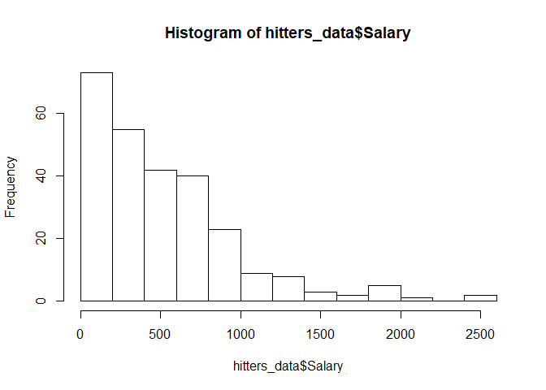
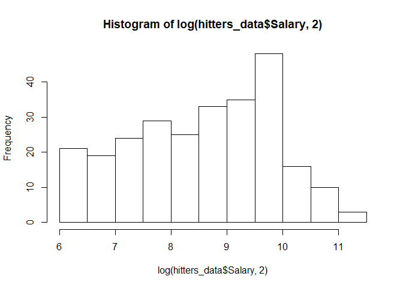
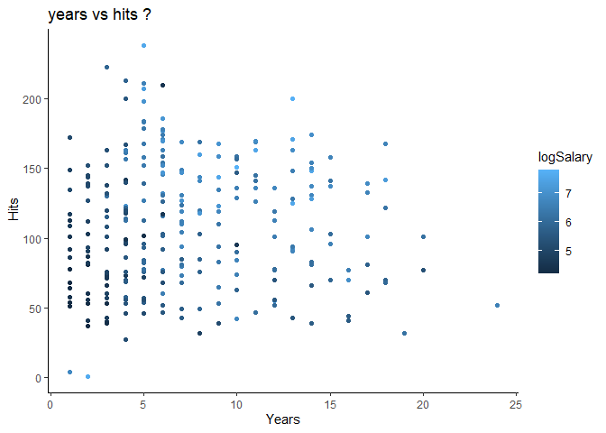
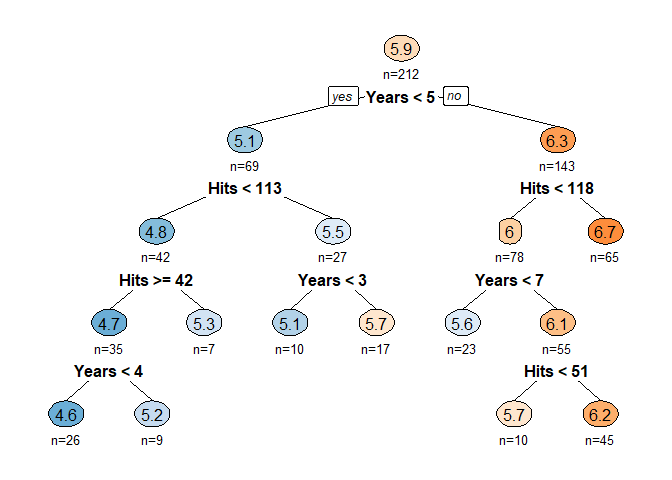
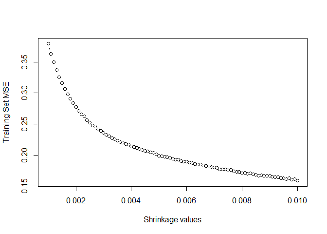
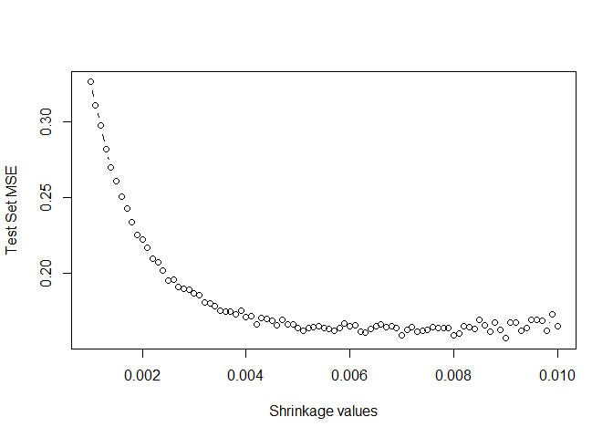
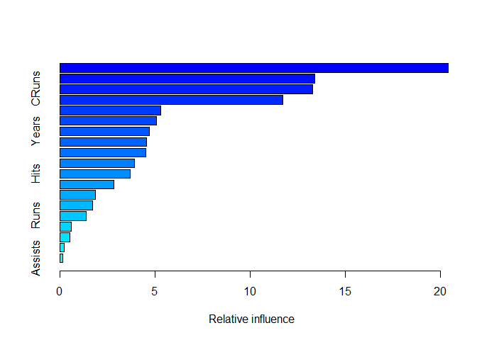
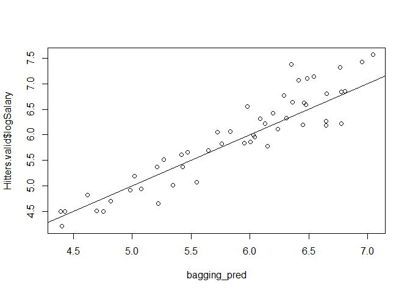

Hitters Salary Prediction
================
Harsh Sharma
11/13/2019

``` r
pacman::p_load(ISLR, MASS, rpart, rpart.plot, caret,ggplot2,randomForest, gbm, tree,leaps, mlbench, data.table)
theme_set(theme_classic())
```

\#Question1 Remove the observations with unknown salary information. How
many \#observations were removed in this process?

``` r
data("Hitters")

hitters.df=setDF(Hitters)
hitters_data=na.omit(hitters.df,cols="Salary")
#no of observations removed = 322-263 = 59
```

\#Question 2 Generate log-transform the salaries. Can you justify this
transformation?

``` r
logSalary <- log(hitters_data$Salary)
hist(hitters_data$Salary)
```

<!-- -->

``` r
hist(log(hitters_data$Salary,2))
```

<!-- -->
\#The log transformation can be used to make highly skewed distributions
less skewed. This can be valuable both for making patterns in the data
more interpretable and for helping to meet the assumptions of
inferential statistics. \#The pattern above is more visible after log
transformation

\#Question3: Create a scatterplot with Hits on the y-axis and Years on
the x-axis using all the \#observations. Color code the observations
using the log Salary variable. What \#patterns do you notice on this
chart, if any?

``` r
mid <- mean(logSalary)

ggplot(hitters_data, aes(x=hitters_data$Years,y=hitters_data$Hits,color=logSalary)) +  geom_point() + 
     xlab("Years") + 
      ylab(" Hits") + 
        ggtitle("years vs hits ?")
```

<!-- -->

\#Interesting pattern found from the graph is that players with high
hits in their early years have \#the highest of salary.

\#Question4: Run a linear regression model of Log Salary on all the
predictors using the entire \#dataset. Use regsubsets() function to
perform best subset selection from the \#regression model. Identify the
best model using BIC. Which predictor variables \#are included in this
(best) model?

``` r
hitters_data$Salary <- NULL
hitters_data$logSalary <- logSalary
search <- regsubsets(hitters_data$logSalary~ ., data = hitters_data, nbest = 1, nvmax = dim(hitters_data)[2],
                     method = "exhaustive")
sum <- summary(search)

# show models
sum$which
```

    ##    (Intercept) AtBat  Hits HmRun  Runs   RBI Walks Years CAtBat CHits CHmRun
    ## 1         TRUE FALSE FALSE FALSE FALSE FALSE FALSE FALSE  FALSE FALSE  FALSE
    ## 2         TRUE FALSE  TRUE FALSE FALSE FALSE FALSE FALSE   TRUE FALSE  FALSE
    ## 3         TRUE FALSE  TRUE FALSE FALSE FALSE  TRUE  TRUE  FALSE FALSE  FALSE
    ## 4         TRUE  TRUE  TRUE FALSE FALSE FALSE  TRUE FALSE   TRUE FALSE  FALSE
    ## 5         TRUE FALSE  TRUE FALSE FALSE FALSE  TRUE  TRUE  FALSE  TRUE  FALSE
    ## 6         TRUE  TRUE  TRUE FALSE FALSE FALSE  TRUE  TRUE  FALSE  TRUE  FALSE
    ## 7         TRUE  TRUE  TRUE FALSE FALSE FALSE  TRUE  TRUE  FALSE FALSE  FALSE
    ## 8         TRUE  TRUE  TRUE FALSE FALSE FALSE  TRUE  TRUE  FALSE FALSE  FALSE
    ## 9         TRUE  TRUE  TRUE FALSE FALSE FALSE  TRUE  TRUE  FALSE FALSE  FALSE
    ## 10        TRUE  TRUE  TRUE FALSE FALSE FALSE  TRUE  TRUE  FALSE FALSE  FALSE
    ## 11        TRUE  TRUE  TRUE  TRUE FALSE FALSE  TRUE  TRUE  FALSE FALSE  FALSE
    ## 12        TRUE  TRUE  TRUE  TRUE FALSE FALSE  TRUE  TRUE  FALSE FALSE  FALSE
    ## 13        TRUE  TRUE  TRUE  TRUE FALSE FALSE  TRUE  TRUE  FALSE FALSE  FALSE
    ## 14        TRUE  TRUE  TRUE  TRUE FALSE FALSE  TRUE  TRUE   TRUE FALSE  FALSE
    ## 15        TRUE  TRUE  TRUE  TRUE FALSE FALSE  TRUE  TRUE   TRUE  TRUE  FALSE
    ## 16        TRUE  TRUE  TRUE  TRUE FALSE  TRUE  TRUE  TRUE   TRUE  TRUE  FALSE
    ## 17        TRUE  TRUE  TRUE  TRUE  TRUE  TRUE  TRUE  TRUE   TRUE  TRUE  FALSE
    ## 18        TRUE  TRUE  TRUE  TRUE  TRUE  TRUE  TRUE  TRUE   TRUE  TRUE  FALSE
    ## 19        TRUE  TRUE  TRUE  TRUE  TRUE  TRUE  TRUE  TRUE   TRUE  TRUE   TRUE
    ##    CRuns  CRBI CWalks LeagueN DivisionW PutOuts Assists Errors NewLeagueN
    ## 1   TRUE FALSE  FALSE   FALSE     FALSE   FALSE   FALSE  FALSE      FALSE
    ## 2  FALSE FALSE  FALSE   FALSE     FALSE   FALSE   FALSE  FALSE      FALSE
    ## 3  FALSE FALSE  FALSE   FALSE     FALSE   FALSE   FALSE  FALSE      FALSE
    ## 4  FALSE FALSE  FALSE   FALSE     FALSE   FALSE   FALSE  FALSE      FALSE
    ## 5  FALSE FALSE  FALSE   FALSE      TRUE   FALSE   FALSE  FALSE      FALSE
    ## 6  FALSE FALSE  FALSE   FALSE      TRUE   FALSE   FALSE  FALSE      FALSE
    ## 7   TRUE FALSE   TRUE   FALSE     FALSE    TRUE   FALSE  FALSE      FALSE
    ## 8   TRUE FALSE   TRUE   FALSE      TRUE    TRUE   FALSE  FALSE      FALSE
    ## 9   TRUE FALSE   TRUE    TRUE      TRUE    TRUE   FALSE  FALSE      FALSE
    ## 10  TRUE FALSE   TRUE    TRUE      TRUE    TRUE   FALSE  FALSE       TRUE
    ## 11  TRUE FALSE   TRUE    TRUE      TRUE    TRUE   FALSE  FALSE       TRUE
    ## 12  TRUE FALSE   TRUE    TRUE      TRUE    TRUE    TRUE   TRUE      FALSE
    ## 13  TRUE FALSE   TRUE    TRUE      TRUE    TRUE    TRUE   TRUE       TRUE
    ## 14  TRUE FALSE   TRUE    TRUE      TRUE    TRUE    TRUE   TRUE       TRUE
    ## 15  TRUE FALSE   TRUE    TRUE      TRUE    TRUE    TRUE   TRUE       TRUE
    ## 16  TRUE FALSE   TRUE    TRUE      TRUE    TRUE    TRUE   TRUE       TRUE
    ## 17  TRUE FALSE   TRUE    TRUE      TRUE    TRUE    TRUE   TRUE       TRUE
    ## 18  TRUE  TRUE   TRUE    TRUE      TRUE    TRUE    TRUE   TRUE       TRUE
    ## 19  TRUE  TRUE   TRUE    TRUE      TRUE    TRUE    TRUE   TRUE       TRUE

``` r
# show metrics
sum$rsq
```

    ##  [1] 0.3857520 0.4822942 0.4986075 0.5090077 0.5190638 0.5270507 0.5355590
    ##  [8] 0.5436891 0.5473898 0.5501579 0.5524819 0.5552470 0.5577193 0.5579177
    ## [15] 0.5582361 0.5583376 0.5584807 0.5585572 0.5585583

``` r
sum$adjr2
```

    ##  [1] 0.3833985 0.4783118 0.4927999 0.5013954 0.5097071 0.5159660 0.5228097
    ##  [8] 0.5293171 0.5312890 0.5323071 0.5328696 0.5338989 0.5346284 0.5329615
    ## [15] 0.5314083 0.5296116 0.5278447 0.5259917 0.5240423

``` r
sum$cp
```

    ##  [1] 79.124523 27.981036 21.001033 17.276086 13.740484 11.343922  8.660386
    ##  [8]  6.185015  6.147901  6.624133  7.344849  7.822749  8.461825 10.352605
    ## [15] 12.177361 14.121460 16.042709 18.000617 20.000000

``` r
sum$bic
```

    ##  [1] -117.0304 -156.4291 -159.2777 -159.2182 -159.0885 -157.9207 -157.1229
    ##  [8] -156.1954 -152.7649 -148.8061 -144.5962 -140.6541 -136.5480 -131.0939
    ## [15] -125.7112 -120.1995 -114.7125 -109.1859 -103.6145

# Predictors included in best model are Hits, Years and Walks

\#Question5 Now create a training data set consisting of 80 percent of
the observations, and a \#test data set consisting of the remaining
observations.

``` r
library("data.table")


# **Split the data into training (80%) and validation/test set (20%)**
set.seed(42)
training.index <- createDataPartition(hitters_data$logSalary, p = 0.8, list = FALSE)
Hitters.train <- hitters_data[training.index, ]
Hitters.valid <- hitters_data[-training.index, ]
```

\#Question6 Generate a regression tree of log Salary using only Years
and Hits variables from \# training data set. Which players are likely
to receive highest salaries \#according to this model? Write down the
rule and elaborate on it.

``` r
# Generate regression tree
set.seed(42)
hitters.train.regtree <- rpart(Hitters.train$logSalary ~ Years + Hits, data = Hitters.train)


prp(hitters.train.regtree, type = 2,extra=1, under = TRUE, split.font = 2, 
    varlen = -10, box.palette = "BuOr")
```

<!-- -->

``` r
rpart.rules(hitters.train.regtree, cover = TRUE ) # find rules
```

    ##  Hitters.train$logSalary                                             cover
    ##                      4.6 when Years <  4      & Hits is  42 to 113     12%
    ##                      5.1 when Years <  3      & Hits >=        113      5%
    ##                      5.2 when Years is 4 to 5 & Hits is  42 to 113      4%
    ##                      5.3 when Years <  5      & Hits <   42             3%
    ##                      5.6 when Years is 5 to 7 & Hits <  118            11%
    ##                      5.7 when Years is 3 to 5 & Hits >=        113      8%
    ##                      5.7 when Years >=      7 & Hits <   51             5%
    ##                      6.2 when Years >=      7 & Hits is  51 to 118     21%
    ##                      6.7 when Years >=      5 & Hits >=        118     31%

\#ANSWER 6 \# The players who have played atleast for 5 years and having
hits greater than or equal to 118 are getting the highest salaries. \#
The rule is when Years \>= 5 & Hits \>= 118. 31% of the players receive
highest salaries.

\#Question7 Now create a regression tree using all the variables in the
training data set. \#Perform boosting on the training set with 1,000
trees for a range of values of the \#shrinkage parameter lambda. Produce
a plot with different shrinkage values on the xaxis and the
\#corresponding training set MSE on the y-axis.

``` r
#Creating the tree with all the parameters

shrink_value = seq(.001, 0.01 , by = .0001)
train_set = rep(NA, length(shrink_value))
for (i in 1:length(shrink_value)){
    boost_tree = gbm(logSalary ~ ., data = Hitters.train, distribution = "gaussian", n.trees = 1000, shrinkage = shrink_value[i])
    pred.train = predict(boost_tree, Hitters.train, n.trees = 1000)
    train_set[i] = mean((pred.train - Hitters.train$logSalary)^2) }
plot(shrink_value, train_set, type = "b", xlab = "Shrinkage values", ylab = "Training Set MSE")
```

<!-- -->

\#Question8 Produce a plot with different shrinkage values on the x-axis
and the corresponding test set MSE on the y-axis

``` r
##Plot for validation data set 
set.seed(42)
test_set <- rep(NA, length(shrink_value))
for (i in 1:length(shrink_value)) {
    boost_tree = gbm(logSalary ~ ., data = Hitters.train, distribution = "gaussian", n.trees = 1000, shrinkage = shrink_value[i])
    yhat = predict(boost_tree, Hitters.valid , n.trees = 1000)
    test_set[i] = mean((yhat - Hitters.valid$logSalary)^2)
}
plot(shrink_value,test_set , type = "b", xlab = "Shrinkage values", ylab = "Test Set MSE")
```

<!-- -->

\#Q9. Which variables appear to be the most important predictors in the
boosted model?

``` r
summary(boost_tree)
```

<!-- -->

    ##                 var    rel.inf
    ## CAtBat       CAtBat 20.4209634
    ## CHits         CHits 13.4183604
    ## CRuns         CRuns 13.3013634
    ## CRBI           CRBI 11.7049175
    ## CWalks       CWalks  5.2930543
    ## PutOuts     PutOuts  5.0868138
    ## Years         Years  4.7007192
    ## CHmRun       CHmRun  4.5462274
    ## Walks         Walks  4.5423199
    ## RBI             RBI  3.9113974
    ## Hits           Hits  3.6875758
    ## HmRun         HmRun  2.8452285
    ## Errors       Errors  1.8674552
    ## AtBat         AtBat  1.7406156
    ## Runs           Runs  1.3731800
    ## League       League  0.6047697
    ## Division   Division  0.5512298
    ## NewLeague NewLeague  0.2260424
    ## Assists     Assists  0.1777662

\#In the above plot, we could infer that CAtBat is the most vital and
imporatnt predictor in the model.

\#Question 10 - Now apply bagging to the training set. What is the test
set MSE for this approach?

``` r
set.seed(42)
bagging <- randomForest(logSalary~., data = Hitters.train, importance = TRUE)
bagging_pred <- predict(bagging, Hitters.valid)
plot(bagging_pred, Hitters.valid$logSalary)
abline(0,1)
```

<!-- -->

``` r
mean((bagging_pred - Hitters.valid$logSalary)^2)
```

    ## [1] 0.1178609
